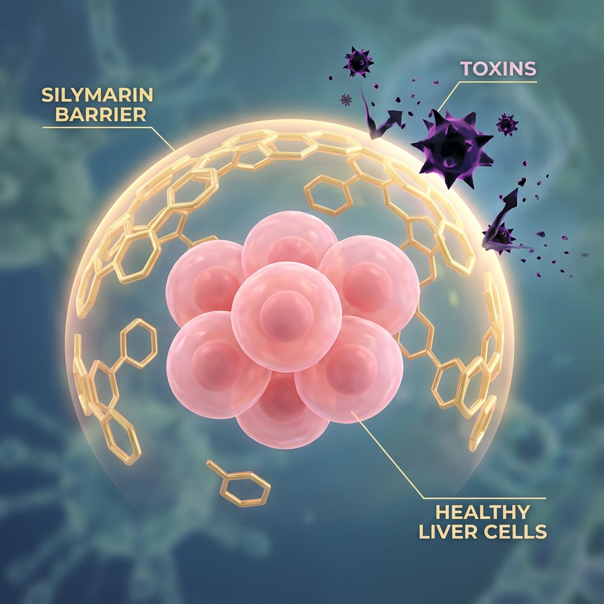
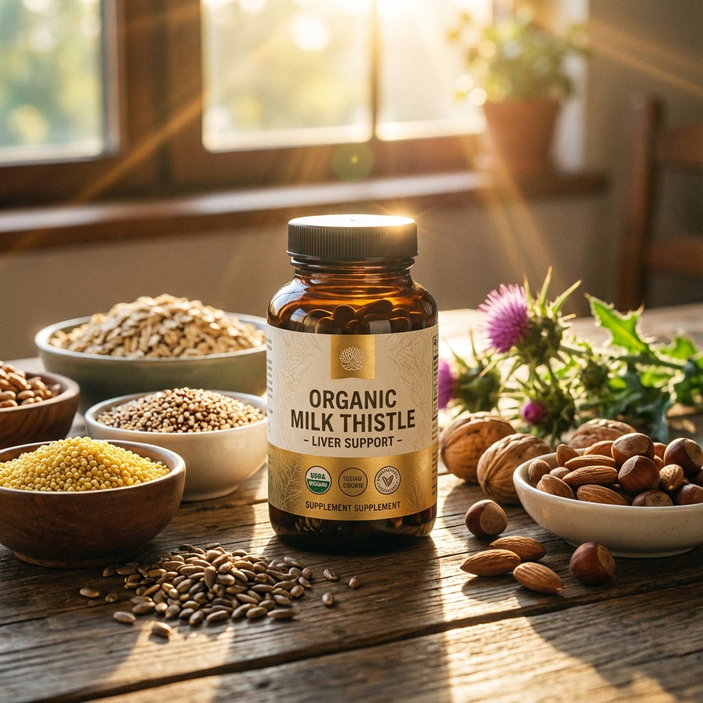

  

    💊 "간 때문이야~" 노래, 다들 아시죠?  
    피곤하면 가장 먼저 찾는 영양제, 바로 **밀크씨슬(실리마린)** 입니다.  
    하지만 밀크씨슬이 숙취해소제가 아니라는 사실, 알고 계셨나요?  
    오늘은 국민 영양제 **실리마린**에 대해 약사가 팩트체크 해드립니다.
  

---

## 🌿 밀크씨슬? 실리마린? 뭐가 다른가요?

영양제 통을 보면 어떤 건 **Milk Thistle**, 어떤 건 **Silymarin**이라고 적혀 있어서 헷갈리셨죠?

*   **밀크씨슬 (Milk Thistle)**: 엉겅퀴과의 식물 이름입니다. '마리아 엉겅퀴'라고도 불립니다.
*   **실리마린 (Silymarin)**: 밀크씨슬 씨앗 속에서 추출한 **핵심 유효 성분**입니다.

쉽게 말해 **'인삼'** 과 **'사포닌'** 의 관계와 같습니다. 우리가 효과를 보려면 식물 껍데기만 먹는 게 아니라, 그 안의 알맹이인 **'실리마린' 함량**을 확인해야 합니다.

---

## 🛡️ 실리마린의 진짜 효능 3가지

실리마린은 단순히 '술 깨는 약'이 아닙니다. 간세포를 보호하고 재생시키는 강력한 **항산화제**입니다.

### 1. 간세포 보호막 형성 (방패 작용)
실리마린은 간세포 외부 막을 튼튼하게 감싸서, 독소 물질이 간세포 안으로 뚫고 들어오지 못하게 막아줍니다. 술이나 약물로 인한 간 손상을 1차적으로 방어하는 **방패** 역할을 합니다.

### 2. 손상된 간세포 재생 (재활 공장)
이미 손상된 간세포 내에서 단백질 합성을 촉진합니다. 즉, 망가진 간세포가 다시 건강하게 일어설 수 있도록 돕는 **재생 촉진제**입니다.

### 3. 강력한 항산화 효과 (청소부)
간은 우리 몸의 화학 공장이라 활성산소가 많이 생깁니다. 실리마린은 비타민E보다 훨씬 강력한 항산화력으로 이 활성산소를 제거해 간의 부담을 덜어줍니다.

---

## ⚠️ 부작용 및 주의사항: "누구나 먹어도 되나요?"

천연 식물 추출물이라 비교적 안전하지만, 주의해야 할 분들이 있습니다.

*   **위장 장애**: 과량 섭취 시 설사나 복통을 유발할 수 있습니다. 식사 후에 드시는 것이 좋습니다.
*   **⚠️ 호르몬 관련 질환**: 실리마린은 에스트로겐과 유사한 작용을 할 수 있습니다. **자궁근종, 유방암** 등 호르몬 민감성 질환이 있는 분들은 섭취 전 반드시 전문가와 상의하세요.
*   **알레르기**: 국화과 식물(쑥, 돼지풀 등)에 알레르기가 있다면 주의가 필요합니다.

---

## 🧐 좋은 밀크씨슬 고르는 기준 (약사 Tip)

마트나 인터넷에 널린 게 밀크씨슬이지만, 다 같은 품질은 아닙니다.

1.  **실리마린 유효 함량 확인**: 식약처 권장 일일 섭취량은 **130mg**입니다. 제품 표면에 '밀크씨슬 추출물' 양이 아니라, **'실리마린으로서 130mg'** 인지 확인하세요.
2.  **원료의 순도와 원산지**: 저가형 중국산 원료보다는 유럽산(프랑스, 이탈리아 등) 원료가 순도와 품질 면에서 신뢰할 만합니다.
3.  **흡수율 기술 (파이토솜)**: 실리마린은 입자가 커서 그냥 먹으면 흡수가 잘 안 됩니다. 인지질로 감싼 **'파이토솜(Phytosome)'** 공법이 적용된 제품은 흡수율이 훨씬 높습니다.
4.  **복합 성분 배합**: 간 대사에 필수적인 **비타민 B군(B1, B2, B6)** 이 함께 들어있으면 피로 회복 시너지가 훨씬 좋습니다.

---

## ✨ 약사의 결론: "당신의 간은 안녕하신가요?"

밀크씨슬은 마법의 약이 아닙니다. 술을 매일 마시면서 밀크씨슬 하나 믿고 버티는 건, **방탄조끼 믿고 총알받이로 뛰어드는 것**과 같습니다.

1.  **가장 좋은 간 영양제는 '금주'와 '휴식'입니다.**
2.  하지만 피치 못하게 무리해야 한다면, **고품질의 실리마린**이 훌륭한 보험이 되어줄 수 있습니다.
3.  특히 **만성 피로**가 심하다면 비타민 B군과 함께 섭취해보세요. 아침에 눈 뜨는 게 달라질 겁니다.

여러분의 활기찬 아침을 응원합니다! 💪

---

  
📱 내 간에 딱 맞는 영양제 조합이 궁금하다면?

  

    <a href="https://jeongyungeun.github.io/mirinae_landing/" target="_blank" rel="noopener noreferrer" className="text-[#ff9300] hover:underline flex items-center gap-2">
      🌐 미리내 약국 앱 다운로드
    </a>
    약사가 직접 큐레이션한 증상별 맞춤 영양제를 만나보세요.
  

